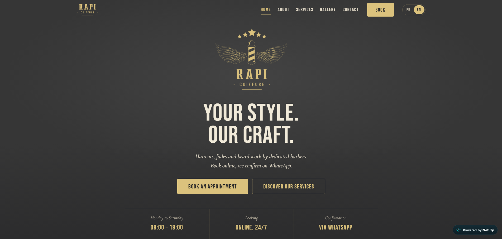

# Rapi Coiffure

A website for Rapi Coiffure, a barbershop, with online booking in French and English.

**Live site:** [rapicoiffure.netlify.app](https://rapicoiffure.netlify.app)
**Status:** Almost finished

## What it does

Clients choose French or English, book an appointment in five short steps, and the request is sent to the shop on WhatsApp. When the shop confirms the appointment, the client receives a payment link, so nobody pays for a slot that hasn't been confirmed.

## What I built

- French by default, with English one tap away
- A five-step booking flow with progress, back and continue at every step
- Booking requests sent to WhatsApp, with a payment link after the shop confirms
- Services and prices, a gallery, opening hours and contact details
- A layout that works on phones first

## Built with

HTML, CSS and JavaScript. Hosted on Netlify.

## Run it on your computer

Download this repository and open `index.html` in any browser.

---

Built by [Fisnik Zenuli](https://github.com/fisnikzenuli)
